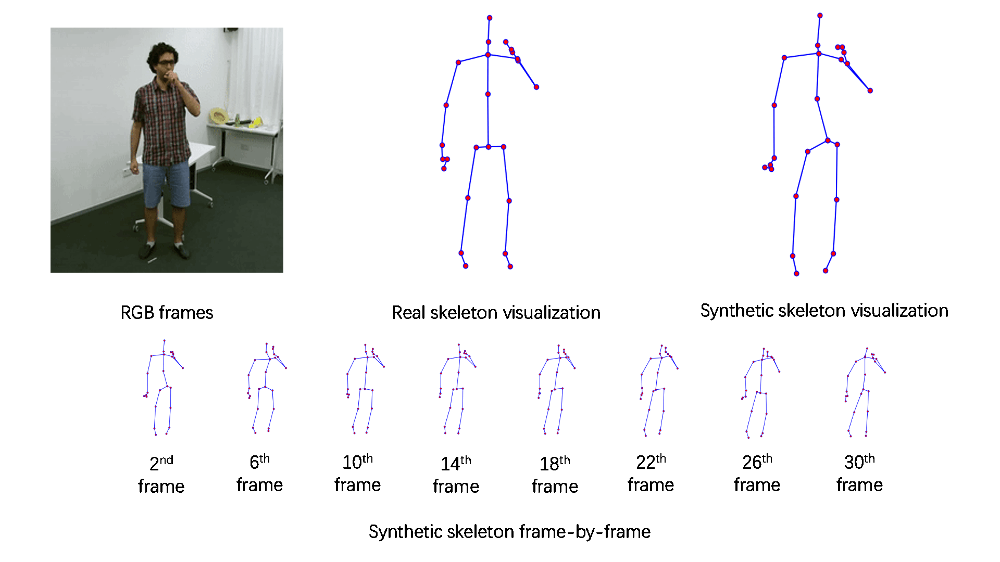

<p align="center">
Two examples of synthetic action sequences. Upper sequence indicates the Cough action category, while below sequence indicates the Blow nose action category.
</p>


# Abstract

Over the past two years, Coronavirus disease 2019 (COVID-19) caused a significant loss on both the economy and public health. As a result, researchers began to notice the importance of detecting a novel disease at an early stage. Leveraging from the rapid development of artificial intelligence (AI), many AI-based COVID-19 detection approaches have been presented recently. However, a well-trained AI model always demands high-quality and sufficient data, which is hard to obtain during an early spreading stage of the novel disease. In this paper, we present a novel skeleton-based action synthesis method, which can effectively generate high-quality and diverse sequential actions corresponding to the most common COVID-19 symptoms. In order to obtain synthetic action sequences, we propose a GAN inversion method that can generate a series of synthetic action sequences by editing a real action sequence. We evaluate the proposed method on a well-known action recognition dataset in two levels: skeleton quality and action recognition.  The results show that our method outperforms the baseline approaches, and it can also be effectively deployed to action recognition modules with significant performance improvement. 


<p align="center">
Overview of the proposed method. Subfigure (a) indicates the original StyleGAN2 generation approach. Subfigure (b) indicates the proposed method.
</p>

# Overview

We introduce the proposed method in this section with details. In above figure, we demonstrate the overview of the proposed method and compare it to the original StyleGAN2 generation approach. Basically, a traditional StyleGAN2 generation process starts from sampling a latent vector $z$ from latent space $Z$ and map it into latent vector $w$ with a mapping network $F(\cdot)$. Then, generator $G(\cdot)$ takes both latent vector $w$ and random noise vector $n$ and synthesizes a fake skeleton image. The drawback of the traditional StyleGAN2 generation process is that it is not controllable for certain action categories, for instance, coughing and blowing the nose. Comparing to the traditional StyleGAN2 generation process, the proposed method takes a reference input of a real skeleton image. Rather than generating a fake image with a random category, the proposed method can generate synthetic images with a certain category that is conditioned by the reference input.

You can use the [editor on GitHub](https://github.com/yfjiangworks/COVID19_Action_Synthesis/edit/gh-pages/index.md) to maintain and preview the content for your website in Markdown files.

Whenever you commit to this repository, GitHub Pages will run [Jekyll](https://jekyllrb.com/) to rebuild the pages in your site, from the content in your Markdown files.

### Markdown

Markdown is a lightweight and easy-to-use syntax for styling your writing. It includes conventions for

```markdown
Syntax highlighted code block

# Header 1
## Header 2
### Header 3

- Bulleted
- List

1. Numbered
2. List

**Bold** and _Italic_ and `Code` text

[Link](url) and 
```

For more details see [Basic writing and formatting syntax](https://docs.github.com/en/github/writing-on-github/getting-started-with-writing-and-formatting-on-github/basic-writing-and-formatting-syntax).

### Jekyll Themes

Your Pages site will use the layout and styles from the Jekyll theme you have selected in your [repository settings](https://github.com/yfjiangworks/COVID19_Action_Synthesis/settings/pages). The name of this theme is saved in the Jekyll `_config.yml` configuration file.

### Support or Contact

Having trouble with Pages? Check out our [documentation](https://docs.github.com/categories/github-pages-basics/) or [contact support](https://support.github.com/contact) and we’ll help you sort it out.
