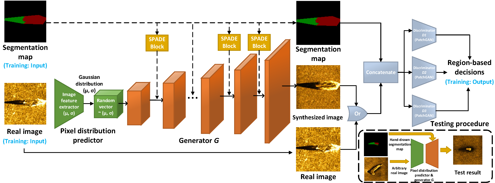

# Abstract

Coronavirus disease 2019 (COVID-19) is an ongoing global pandemic that has spread rapidly since December 2019. Real-time reverse transcription polymerase chain reaction (rRT-PCR) and chest computed tomography (CT) imaging both play an important role in COVID-19 diagnosis. Chest CT imaging offers the benefits of quick reporting, a low cost, and high sensitivity for the detection of pulmonary infection. Recently, deep-learning-based computer vision methods have demonstrated great promise for use in medical imaging applications, including X-rays, magnetic resonance imaging, and CT imaging. However, training a deep-learning model requires large volumes of data, and medical staff faces a high risk when collecting COVID-19 CT data due to the high infectivity of the disease. Another issue is the lack of experts available for data labeling. In order to meet the data requirements for COVID-19 CT imaging, we propose a CT image synthesis approach based on a conditional generative adversarial network that can effectively generate high-quality and realistic COVID-19 CT images for use in deep-learning-based medical imaging tasks. Experimental results show that the proposed method outperforms other state-of-the-art image synthesis methods with the generated COVID-19 CT images and indicates promising for various machine learning applications including semantic segmentation and classification.

# Overview


<p align="center">
Overview of the proposed method. The upper section containing the training process of the global-local generator and multi-resolution discriminator, while the lower right section shows the testing process. Within the global-local generator blocks, two types of generator are present: a global information generator and local detail generator. Two individual training processes and single-joint training process are depicted in three different colorized arrows. DESUM block represents the dynamic element-wise sum process which is shown in purple. The multi-resolution discriminator is depicted in blue. And the dynamic feature matching process (DFM) is also shown as a blue block. The synthesized images are transferred from the generator to the discriminator, and this process is shown as the dashed arrow. The yellow arrow shows the completion step for the process in which the non-lung region for the synthesized lung image is added.
</p>

In this paper, we propose a cGAN-based COVID-19 CT image synthesis method. Here, COVID-19 CT image synthesis is formulated as a semantic-layout-conditional image-to-image translation task. The structure consisting of two main components: a global-local generator and a multi-resolution discriminator. During the training stage, the semantic segmentation map of a corresponding CT image is passed to the global-local generator, where the label information from the segmentation map is extracted via down-sampling and re-rendered to generate a synthesized image via up-sampling. The segmentation map is then concatenated with the corresponding CT image or synthesized CT image to form the input for the multi-resolution discriminator, which is used to distinguish the input as either real or synthesized. The decisions from the discriminator are used to calculate the loss and update the parameters for both the generator and discriminator. During the testing stage, only the generator is involved. A data augmented segmentation map is used as input for the generator, from which a realistic synthesized image can be obtained after extraction and re-rendering. This synthesized lung CT image is then combined with the non-lung area to form a completely synthesized CT image as the final result. Above figure presents an overview of the proposed method.

# Synthetic COVID-19 CT samples

<p align="center">
Synthetic lung CT images generated by the proposed method and the other two competitive state-of-the-art image synthesis approaches. The first column shows the segmentation map including the lung (red), ground-glass opacity (blue), and consolidation (green) areas. The second column shows the original CT image. The third, fourth, fifth columns show the synthetic samples which are generated by the proposed method, SEAN and SPADE in order. Each case is presented with zoom in order to show more details, and the yellow arrows point out the special area which is described in the main text.
</p>


<p align="center">
Synthetic lung CT images generated by the proposed method. Eight samples are selected, each from an individual patient. The first column shows the segmentation map including the lung (red), ground-glass opacity (blue), and consolidation (green) areas. The second and third columns show the original and synthetic CT images, respectively. The synthetic CT images here merge the synthetic lung CT image and the corresponding real non-lung area. The fourth and fifth columns depict CT images for the original lung and synthesized CT images, respectively.
</p>

# Acknowlegements
This research work is supported by a National Research Foundation (NRF) grant funded by the MSIP of Korea (number 2019R1A2C2009480).

```
@article{jiang2020covid,
  title={COVID-19 CT image synthesis with a conditional generative adversarial network},
  author={Jiang, Yifan and Chen, Han and Loew, Murray and Ko, Hanseok},
  journal={IEEE Journal of Biomedical and Health Informatics},
  volume={25},
  number={2},
  pages={441--452},
  year={2020},
  publisher={IEEE}
}
```
