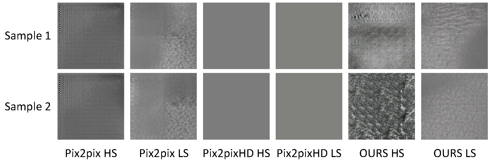
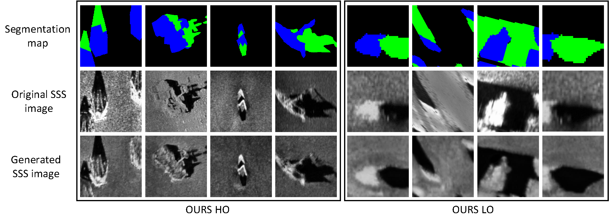

<p align="center">
Demonstration of domain shift problem and proposed solution. (A) Model trained on a large synthetic dataset then tested on real data; (B) Model trained on a large real dataset then tested on real data; (C) The proposed model trained on a large synthetic dataset and few real data, then evaluated on real data.
</p>


# Abstract

Coronavirus disease 2019 (COVID-19) is a Public Health Emergency of International Concern infecting more than 40 million people across 188 countries and territories. Chest computed tomography (CT) imaging technique benefits from its high diagnostic accuracy and robustness, it has become an indispensable way for COVID-19 mass testing. Recently, deep learning approaches have become an effective tool for automatic screening of medical images, and it is also being considered for COVID-19 diagnosis. However, the high infection risk involved with COVID-19 leads to relative sparseness of collected labeled data limiting the performance of such methodologies. Moreover, accurately labeling  CT images require expertise of radiologists making the process expensive and time-consuming. In order to tackle the above issues, we propose a supervised domain adaption based COVID-19 CT diagnostic method which can perform effectively when only a small samples of labeled CT scans are available. To compensate for the sparseness of labeled data, the proposed method utilizes a large amount of synthetic COVID-19 CT images and adjusts the networks from the source domain (synthetic data) to the target domain (real data) with a cross-domain training mechanism. Experimental results show that the proposed method achieves state-of-the-art performance on few-shot COVID-19 CT imaging based diagnostic tasks.

# Overview


<p align="center">
Overview of the proposed method.
</p>

In this work, we propose a novel Siamese network based model for a few-shot COVID-19 CT diagnostic task as illustrated in above figure. The Siamese network structure is basically formed in three components: source branch ***f(•)***, target branch ***f(•)*** and prediction branch ***g(•)***.  Source and target branches have the same network structure which consists of a feature extractor and two fully-connected (FC) layers. The prediction branch is a network that contains three FC layers. During the training stage, weight sharing occurs between source and target branches as they take staggered input of synthetic and real. The classification loss ***Lc*** and the cross-domain loss ***Lcp, Lcd*** are used together to construct the overall loss for updating the network. During the test stage, a real CT image is passed through the network, and the network makes a binary diagnostic decision.


# Boosted COVID-19 diagnostic performance

<p align="center">
Diagnostic performance comparison of few-shot COVID-19 CT diagnostic task (n-shot: 5-shot, feature extractor: Xception, the best evaluation score is marked in bold. Higher number of the metrics is better.
</p>

# Acknowlegements
This research work is supported by a National Research Foundation (NRF) grant funded by the MSIP of Korea (number 2019R1A2C2009480).

# Citation
```
@inproceedings{jiang2021few,
  title={Few-shot learning for ct scan based covid-19 diagnosis},
  author={Jiang, Yifan and Chen, Han and Ko, Hanseok and Han, David K},
  booktitle={ICASSP 2021-2021 IEEE International Conference on Acoustics, Speech and Signal Processing (ICASSP)},
  pages={1045--1049},
  year={2021},
  organization={IEEE}
}
```
